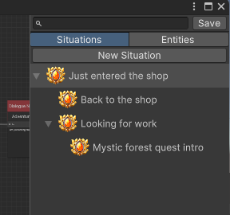
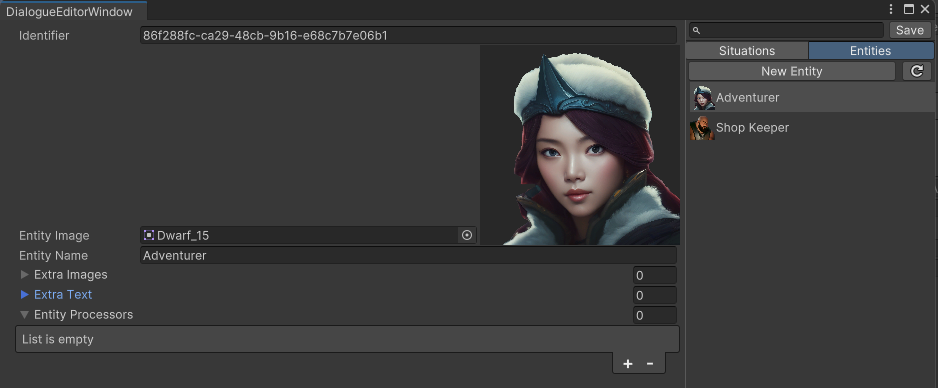
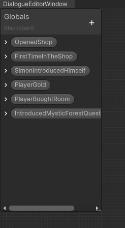

# Introduction

DialogueGraphBuilder is a light weight Unity tool that allows you to create complex dialogue flows, dialogue entities, variables and events all while giving you multiple ways to make it as modular as possible. 

This tool is open source, completely free and ready to use for any commercial and non commercial projects.

DialogueGraphBuilder has been tested in Unity on the following platforms:
- PC/Linux
- Android
- WebGL

# Features

- Completely self contained EditorWindow
- User defined situations
- User defined entity maker
- Shader graph like dialogue graph editor
- Dialogue nodes with text and entity selection picker
- Choice nodes with player input choices
- Transfer nodes to move the flow to different situations
- Tree hierarchy window to stay organised with multiple situations
- Search toolbar for situations and created entities
- User defined integer and boolean variables usable in both the editor and code
- Condition nodes redirecting the flow based on user defined variables
- Expression nodes to manipulate user defined variables
- Support for global, user defined Events that can be used as nodes to trigger C# events
- One DialogueMaster providing the necessary API
- All in one json saved file
- Automated C# script generation whenever necessary data receives an update
- Automatic danger logger to let user know there are errors to fix before letting them save

# Installation

DialogueGraphBuilder currently supports the following:

1. From source
2. From the Releases page (TODO)
3. From the AssetStore (TODO)

It's recommended to download the package from the Releases page as this guarantees you will get the most up to date version of the project.

# Quick Setup

## Editor

In order to start using the tool, after installing the package, navigate to Create>Chocolate4/DialogueEditor.

Double click on the asset and the tool is ready to use.

## Build/Playmode

To start using the tool in build/playmode, a scene

# Documentation

All of the changes made in the Editor are cached in memory. When you close the window all of the unsaved changes will be lost, before exiting the editor make sure to press the Save button.

## Situations

The Editor window features a TreeView of Situations. With the "New Situation" button you can create new situations and reorder them in the TreeView's hierarchy. The search window to the left of the "Save" button allows you to filter created situations by name.



Pressing RMB on any situation will give you access to ContextualMenu and options to either rename or delete a given situation.

## Entities

The "New Entity" button allows you to create entities and edit them in the editor window. All of the entities are stored in memory until the "Save" button is pressed.

All the entities are ScriptableObject instances of ```DialogueSpeaker```. On the left side of the view you have read/write access to the entity objects.

These objects contain Identifier, EntityImage, EntityName as well as extraImages and extraText. All of this information can be accessed at runtime from [DialogueNodeInfo](#dialoguenodeinfo) propagated by [DialogueMaster's](#dialoguemaster) API.

The Identifier is unique for each entity, but is shared among clones of the same instance.

In addition there is an exposed a List of [IEntityProcessor](#ientityprocessor) you can use on every entity. You can make your own processors to make use of extra entity data. 

The button right next to the "New Entity" button allows to sort the entities by name.

Similarly to how it worked in the Situations hierarchy, the search window to the left of the "Save" button allows you to filter created entities by name.



Pressing RMB on any Entity will give you access to ContextualMenu to delete an entity.

### IEntityProcessor

IEntityProcessor is an interface that allows to define a collection of behaviours or modifications to the entity. See example usage in [ShopKeeper](#shopkeeper).

Whenever an entity is processed, a clone of the DialogueEntity is created. Thanks to this behaviour, you can safely edit the cloned scriptable object inside of a custom processor and use the processed data.

```csharp
public DialogueEntity Process(DialogueMaster master, DialogueEntity speaker)
{
}
```

The processing is especially useful when switching the image or name of an entity at runtime. In order to process an entity with custom processors, begin by implementing ```IEntityProcessor``` and assign your custom processor to the EntityProcessors list in the EntityView.

Instead of directly using the entity provided by [DialogueNodeInfo](#dialoguenodeinfo), use the following pattern:

```csharp
using (DialogueEntity processedEntity = newSpeaker.Process(dialogueMaster))
{
    // set your presentation objects using processedEntity fields.
}
```

The above approach will create a processed clone of the entity with identifier identical to the original.

## DialogueMaster

Dialogue Master is a component responsible for running the dialogue graph flow at runtime. It provides the API to Start different situations, receive current [node info](#dialoguenodeinfo) or grant access to variable [collection](#collections) of the current asset.

In order to use the master, simply add the component to an object in the hierarchy and set exposed fields in the inspector.

Public methods in the master include:

#### ```Initialize()```

For the initialization purposes you are given an option to either initialize the master from the Awake method, this is done by ticking ```autoInitialize``` field, or from this method. This method has to be invoked before ```DialogueMaster``` can work properly.

#### ```StartSituation(string situationName)```

Allows to start a situation explicitly at any given moment. It will set the current node to either [StartNode](#start-node) or [FromSituationNode](#from-situation-node). No situation is set by default, this method has to be called before calling ```NextDialogueElement()```.

#### ```NextDialogueElement()```

This method will proceed with dialogue flow in a given situation. Returns [DialogueNodeInfo](#dialoguenodeinfo.) that allows you to interact with the Dialogue graph externally. This method will usually be called whenever player makes a choice, wants to progress in the dialogue or when a situation has ended.

Invoking ```NextDialogueElement()``` when [DialogueNodeInfo](#dialoguenodeinfo) returns ```IsChoiceNode``` before using ```SetSelectedChoice(int index)```, will result in the first choice being selected, previously selected choice selected, or an error if the number of choices in the current node is smaller than previously selected choice index.

#### ```SetSelectedChoice(int index)```

When arriving at the [ChoiceNode](#choice-node), this method has to be called when the player makes their choice with the index of said choice. 

#### ```GetCollection<T>()```

This method allows you to get access to currently selected [collection](#collections) in the asset. Use the collection to interact with variables and events.

### Collections

Collections are per asset generated scripts with variables and events defined in the graph's [blackboard](#blackboard), and situation names defined in the [tree view](#situations). They allow you to gain read/write access to any variable you create within the assets' EditorWindow tool.

All the collections are automatically generated inside Runtime/Master/Collections folder, after you create the Dialogue Asset. Note that any changes made to this file will be lost if not made from within the asset.

You can access the current collection from the [DialogueMaster](#dialoguemaster) by invoking ```DialogueMaster.GetCollection<T>()``` where T is the asset name followed by the word "Collection". The IntelliSense of your code editor should allow you to see the collection once you've saved changes in the assets' EditorWindow.

Collections are created at runtime inside of ```DialogueMaster``` based on the asset you provide it with (field ```DialogueMaster.dialogueAsset```). 

All the variable values in the collection can be read and set by the user. All the events can be subscribed to or unsubscribed from (see [EventNode](#event-node)).

## DialogueNodeInfo

```DialogueNodeInfo``` is sent by ```DialogueMaster.NextDialogueElement()``` method. In the class, you will find any information you need from a node while traversing the graph, such as speaker, dialogue text, choices and whether situation has ended.

```DialogueNodeInfo``` is sent only on [Dialogue](#dialogue-node), [Choice](#choice-node) and [End](#end-node) nodes. When sent, the dialogue flow will stop along with it, allowing you to process the active node yourself, and call ```DialogueMaster.NextDialogueElement()``` again when needed. All other nodes are processed internally immiedately, until the three above mentioned nodes are reached in the flow for you to use.

When [ToSituationNode](#to-situation-node) is reached, it will immiedately switch to the next situation

## Graph View

### Blackboard

Blackboard is a collection of dialogue variables and events, similar to ShaderGraph's blackboard. 



By pressing the "+" icon in the top right, you will be able to create variables and events that can be used across [situations](#situations). The default value of each variable can be set by expanding the "Pill" with the ">" button.

Event is a special Pill which doesn't have any default value, and can be dragged into the graph view to create an [Event Node](#event-node).

### Nodes

Graph view supports a variety of nodes to help you build the flow. Additionally you can also group the nodes by pressing RMB or navigating to Dialogue>Group in the search window opened by pressing Space. The selected nodes can be grouped all at once by creating group using the above methods while having nodes selected.

To remove a node from a group, while holding Shift press on a given node. Aside from the [Start Node](#start-node) every node can be deleted by either pressing the Del key on the keyboard or by pressing RMB and pressing "Remove" on the contextual menu.

DialogueGraphBuilder allows for cyclic node connections, however the user should remain cautious when creating such connections as they may lead to unwanted behaviours.

#### Dialogue Node

Dialogue node is the simplest node in the project. It features the entity selection picker as well as the text field reserved for the dialogue. 

### Choice Node

Choice node allows you to set any number of choices received by the player, and redirecting the flow based on a selected choice. Pressing the "+" button will create a new choice and pressing "-" button will remove it.

To define the choice text given to the player, expand the choice foldout and enter any text you'd want them to see.

When a Choice node is encountered at runtime, it will return a list of choices in the [DialogueNodeInfo](#dialoguenodeinfo).

#### Expression Node

The Expression Node allows to set a blackboard variable without touching any code.

This node allows for any number of expressions separated by ';'.

Basic C# operators (=, *, +, -, /) are supported.

Examples:

> MyInt = 3; MyInt = 3 * MyOtherInt; MyBool = MyOtherBool || MyThirdBool ...

#### Condition Node

Condition node is a powerfull node that allows to redirect the flow of dialogue depending on variables.

Allowed expressions include constant number comparisons and blackboard variable comparisons.

Basic C# operators (<=, <, ==, >, >=, ||, &&) are supported.

Examples:

> MyInt <= 3;

> 3 == 3;

> MyBool == true; 

For more details see [Expression Parser by Bunny83](https://github.com/Bunny83/LSystem)

#### Start Node

Start node is a node that will be present in every situation.

All the situations begin at the Start Node, unless the situation was switched to by using [To Situation Node](#to-situation-node) or from code by using ```DialogueMaster.StartSituation(situationName)```.

#### End Node

End Node is when a situation stops. Once the flow arrives at this node, ```DialogueMaster.NextDialogueElement()``` returns ```DialogueNodeInfo``` with SituationEnded set to true.

If it is attempted to move past the End Node with ```DialogueMaster.NextDialogueElement()```, ```NextNodeInfo``` will return the node the flow started this situation from, however it is recommended to disable any further attempts after ```SituationEnded``` is sent.

#### From Situation Node

This node allows to create a point where dialogue should continue from, when the situation the flow came from, is set as value of this node. In a situation, there can only be one ```FromSituationNode``` navigating to the same situation.

From Situation Nodes allow for specific transition that would not be otherwise possible only by using Start Nodes.

When changing the situation by using [To Situation Node](#to-situation-node) or from code by using ```DialogueMaster.StartSituation(situationName)```, ```DialogueMaster``` first checks if this type of node is present with the value of the previous situation and if so continues the dialogue from it. Otherwise it starts at the [Start Node](#start-node).

In a situation, there can be no more than one From Situation Node with its value set to a given situation. All From Situation Nodes have to point to a different situation.

#### To Situation Node

This node allows the dialogue to change the current situation into one specified in the node.

Unlike [From Situation Node](#from-situation-node), there can be multiple nodes of this type that navigate to the same situation.

When changing the situation by using this node or from code by using ```DialogueMaster.StartSituation(situationName)```, ```DialogueMaster``` first checks if [From Situation Node](#from-situation-node) is present with the value of the situation this node is located in, if that is the case, continues the dialogue from [From Situation Node](#from-situation-node), otherwise it starts at the [Start Node](#start-node) in the new situation.

#### Event Node

Event nodes are created by dragging Event Pills into the [Graph View](#graph-view). Once the flow reaches the event node, an event with the blackboards' event name in PascalCase is fired from the asset [collection](#collections).

# Examples

## Princess and the King

This example features a the simplest way to use the DialogueMaster's API provided by this project as well as a very simple way to handle the flow of the nodes.

The Scene features one speaker portrait, a name plate and a text box while the dialogue asset is a one situation linear connection through dialogue nodes.

```SimpleDialogueProgressor``` is a class that displays the StartDialogue button as well as makes the initial call to the ```DialogueMaster``` prompting it to StartSituation by using the situation name provided by ```SimpleProgressionCollection```.
```csharp
...

public virtual void StartSituation()
{
    dialogueMaster.StartSituation(SimpleProgressionCollection.PrincessApproachesKing);
    ...
}
```

Whenever the StartDialogue button vanishes from the screen, another invisible button fills up the screen with an onClick event to ProgressDialogue. ```SimpleDialogueProgressor``` then makes a call to ```DialogueMaster``` to get the NextDialogueElement which returns ```DialogueNodeInfo``` for the SimpleDialogueProgressor to handle.

This progressor only needs to know if the situation has ended or the node wsa a dialogue node. When any of these happend it sends its own events to let anything know of the current node. ```SimpleDialogueDisplayer``` listens to these events and uses ```DialogueNodeInfo``` to set the text presentation, speaker image and their name. 

## Guard at the gate

This example is a slightly more complex. It showcases node connections in the asset to benefit fully from the modularity of the situations. After arriving at the choice node, the player is prompt with a choice to either try to bribe the guard in order to enter the city or leave. 

Once the choice is made to bribe the guard, an event ```OnBribeAtTheGate``` is sent for us to handle the result of attempted persuation. This is handled in ```PersuationChecker``` with a flip of the coin.

When the player succeeds the script asks the ```DialogueMaster``` to StartSituation where he is successful in his attempt, otherwise we sent the story to the route where he fails to enter the city. This then leads to a linear dialogue nodes connection which ends briefly.


```csharp
...

if (diceRoll > .5f)
{
    dialogueMaster.StartSituation(basicEventsCollection.GetSituationName(bribeAtTheGateSuccess));
    return;
}

dialogueMaster.StartSituation(basicEventsCollection.GetSituationName(bribeAtTheGateFailure));
```

In order for the ```PersuationChecker``` to get access to the situation name, it first needs the access to this story asset collection. To get the collection ```DialogueMaster.GetCollection<T>``` is used where T is the name of the asset in pascal case followed by the word "Collection".

## Shopkeeper

The most advanced example is the shoopkeeper. It features a tree of situations in the editor of a story you'd find in an RPG game.

In the situation there is a StartDialogue button. After pressing the button a full screen button is activated that lets the player progress through the story.

The story begins with ```ShopKeeperDialogueProgressor```. That makes the first call to the ```DialogueMaster``` to get the assets collection and to begin the situation by the name defined in the Collections' ```SituationNames``` enum. This enum is exposed with the [SerializeField] so that we can tweak it from the inspector.

```csharp
...

public override void StartSituation()
{
   ShopKeeperCollection collection = dialogueMaster.GetCollection<ShopKeeperCollection>();
   dialogueMaster.StartSituation(collection.GetSituationName(startSituation));
   ProgressInDialogue();
}
```

Calling dialogueMaster.StartSituation we end our progress on the ```StartNode```. In order to quickly get to a node the player can interact with (see [Nodes](#nodes)) the ```ProgressInDialogue``` method is used here.

The only thing that differentiates ```ShopKeeperDialogueProgressor``` from ```SimpleDialogueProgressor``` is the ability to send information when choice node is the current node. When the ```DialogueNodeInfo.IsChoiceNode``` comes in as the next node, the event is sent.

```csharp

DialogueNodeInfo nextNodeInfo = base.ProgressInDialogue();
...

if (nextNodeInfo.IsChoiceNode)
{
    OnReceivedChoiceInfo?.Invoke(nextNodeInfo);
    ...
}
```

As the player presses the screen button, ```TwoSpeakerDialogueDisplayer``` receives events send by the ```ShopKeeperDialogueProgressor``` and displays appropriate information (entity images, names and the spoken text itself).

Throught the story the player gets the shopkeeper to introduce himself. After he does so, the boolean in the blackboard ```SimonIntroducedHimself``` is set to true in the expression node.

Once this happends, every time the shopkeeper speaks this variable is used to use extra text list element from the [Entities view](#entities) to set his name to his real name.

This is done in the ```ShopKeeperNameProcessor``` whenever [DialogueNodeInfo](#dialoguenodeinfo) returns the ShopKeeper as a speaker. 

```csharp
public DialogueEntity Process(DialogueMaster master, DialogueEntity speaker)
{
    shopKeeperCollection ??= master.GetCollection<ShopKeeperCollection>();

    speaker.entityName = shopKeeperCollection.SimonIntroducedHimself 
       ? speaker.extraText[0] : speaker.entityName;

   return speaker;
}
```

The processor gets the collection from the [DialogueMaster](#dialoguemaster) and assigns the speaker name to a value defined in the first array position of extraText when Simon introduced himself. This approach is safe because the speaker given as the parameter in the method is a clone of the original ScriptableObject.

A ```PlayerGold``` variable is exposed in the [Blackboard](#blackboard). This variable is used in the dialogue to check if the player has enough gold to purchase a room. The variable is only used in the editor to get its value, while it's only set on the C# side by the ```MoneyManipulator```. 

When the player decides to buy the room, an event ```PlayerBoughtRoom``` is sent via the [Collection](#collections).

in this example ```DialogueMaster``` is set to initialize on Awake. To ensure proper event hook up ```MoneyManipulator``` subscribes to the appropriate event on both Start and OnEnable.

```csharp
private void OnEnable()
{
   if (!dialogueMaster.HasInitialized)
   {
       return;
   }

   shopKeeperCollection = dialogueMaster.GetCollection<ShopKeeperCollection>();
   shopKeeperCollection.PlayerBoughtRoom += ShopKeeperCollection_PlayerBoughtRoom; 
}

...

private void Start()
{
   shopKeeperCollection = dialogueMaster.GetCollection<ShopKeeperCollection>();
   shopKeeperCollection.PlayerBoughtRoom += ShopKeeperCollection_PlayerBoughtRoom;
}
```

Once the event fires, all that has to be done is to subtract the cost of the room from the ```PlayerGold``` variable in the Collection like from any other variable.

```csharp
...

private void ShopKeeperCollection_PlayerBoughtRoom()
{
   shopKeeperCollection.PlayerGold -= RoomCost;
}
```

# Release Notes

## Version 1.0.0 (date)

Initial release for Unity 2022.2.14

# Additional Notes

If you have found a bug, you are welcome to create an issue on the github page, or a pull request if you've made a fix.

# Credits
- Bunny83, Expression Parser https://github.com/Bunny83/LSystem

### Additional credits for art assets used in screenshots
- CaptainCatSparrow, https://assetstore.unity.com/packages/2d/gui/icons/60-free-character-portraits-with-modular-background-242158
- Jesse Munguia, https://jesse-m.itch.io/jungle-pack
- Clembod, https://clembod.itch.io/warrior-free-animation-set
- Black Hammer, https://assetstore.unity.com/packages/2d/gui/fantasy-wooden-gui-free-103811
